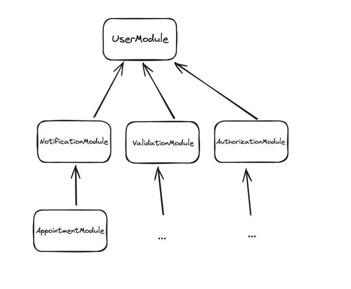
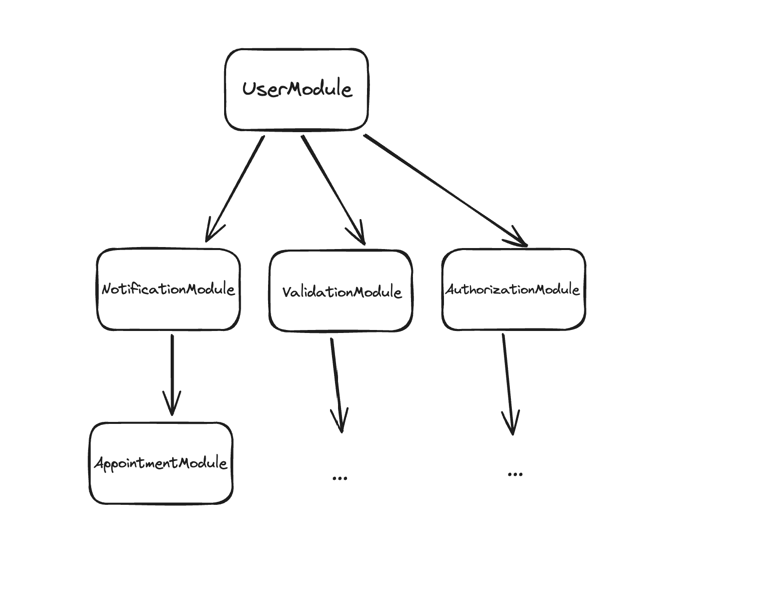

Dependency Inversion Principle (DIP) comes from the famous **SOLID** principles, coined by Uncle Bob back in the 90s.

- **S**ingle Responsibility Principle
- **O**pen-Close Principle
- **L**iskov Substitution Principle
- **I**nterface Segregation Principle
- **D**ependency Inversion Principle

###### Food for the thought: Why are these principles bundled into SOLID, and not spread individually?

Most developers have heard or read something about them to some extent.
From my experience, most devs (myself included) stop after **SO**, leaving **LID** for later days, because they are
confusing.

* Who the hell is Liskov? And whom she's substituting?
* Why do we need to segregate anything — isn't it a bad thing these days?
* And which dependencies should we invert and how? And what about dependency injection?

In this article, I'm going to shed some light on the **Dependency Inversion Principle**, since it's the
most impactful and addicting, in my opinion.
Once I've started inverting the dependencies in my systems, I can't imagine living without it anymore.

## Naming things

> There are only two hard things in Computer Science: cache invalidation and naming things.

So let's deconstruct the name: **_dependency inversion_**

### Dependency

Having a dependency implies that we have at least two of _something_,
and there's a _dependency_ between these _somethings_.
What is _something_? It could be anything really; the only restriction is that this _something_ is somehow bound by
its context.
It might be a single class, a package, a component, a group of packages, a module, or even a standalone
web service.
For example, code that calls the database to fetch a user. There are many possible names for such a thing: domain,
module, component, package, service, etc.
Name is unimportant, as long as it's consistent throughout the discussion.
I'll call it a **module**.
A module that queries a user from somewhere (presumably DB) - the `UserModule`.
That's the first.
But we need one more.
Let's say we want to send a user notification because an appointment with a doctor is confirmed.
And here we have our second module — the `NotificationModule`.

The code might look something like this:

```java
package test.notification;

import test.user.UserModule;
import test.user.User;

public class NotificationModule {

    private final UserModule userModule;

    public NotificationModule(UserModule userModule) {
        this.userModule = userModule;
    }

    public void sendNotification(long userId) {
        userModule.findUserById(userId)
                  .ifPresent(this::sendNotification);
    }

    private void sendNotification(User user) {
        // notification logic
    }
}

```

```java
package test.user;

public class UserModule {

    public Optinal<User> findUserById(long id) {
        //fetching user from the DB
    }
}
```

```java
package test.user;

public class User {
    private String name;
    private String surname;
    private String email;
    //50 more attributes, because why not
}

```

Folder structure:

```bash
├── test
│   ├── notification
│   │   └── NotificationModule.java
│   ├── user
│   │   ├── UserModule.java
│   │   └── User.java

```

According to the code **NotificationModule** _depends on_ **UserModule**.

Such code could be found **everywhere**.
I would go as far as to say that 99% of the code I've read(and written) looks like this.
And it might seem that there's nothing wrong with it.
In the end, it works, it is straightforward to read and easy to understand.
But there's a problem.
Our sacred logic of managing notifications is polluted with something we don't have control over.
Notice, that `UserModule` resides in a different package than `NotificationModule`.
It's not a part of the notification domain.
It's a domain on its own.

From the perspective of the `NotificationModule`, the `UserModule` is a low-level implementation detail.
And this detail is leaking more and more into the module that depends on it.
See the `User` class?
It's part of the `UserModule`, not the `NotificationModule`.
And `NotificationModule` is just one of its clients.
Obviously `UserModule` is used throughout the system.
It's the most used module in the whole system.
Everything depends on it!

But wait.
Why would `NotificationModule` care about where the user is coming from?
It just needs some of the user data, and that's it.
The concept of the user is important, but not where it comes from.
And what if a `User` object is large, but we need only a few fields from it?
Should the new `SmallUser` object be introduced near the `UserModule`?
Isn't this a circular dependency then?
`NotificationModule` depends on `UserModule` in code, but `UserModule` depends on `NotificationModule` indirectly
logically?
It's not hard to imagine how this goes out of hand.
I've seen it go out of hand.
Every.
Single.
Time.
I've seen with my own eyes systems being tied into knots by such modules.
And months and months of refactoring spent just to be reverted with "It's too much.
Too expensive.
Not worth it."
comments.
I wrote such systems.

The root of the problem lies in the dependency **direction**.
**High-level** `NotificationModule` depends on **low-level** `UserModule`.
Level in this case means the level of abstraction.
The further we go from the edge(domain boundary) of the system — the higher we go in terms of abstraction.
For example, modules that talk to DB are on the edge of the system (the scary network),
so as modules that send HTTP calls, talk to message brokers, etc.
However, the modules that prepare notification messages are much further from the edge of the system,
so the level of abstraction is higher.
It's a relative term.
Like Java is categorized as a high-level programming language,
based on its proximity to the bare metal,
in relation to something like Assembly language which is the lowest of them all.

And so the dependency tree might look something like this:



Dependency direction goes with the direction of an arrow.
Everything directly or transitively depends on `UserModule`.
The core of the system is not the business logic, but the module that retrieves a user from the DB.
This is fundamentally wrong.
We want the business logic to drive our system, not the _I-know-how-to-talk-to-a-database_-thingy.

### Inversion

This is pretty much self-explanatory, or so it seems.
Google tells me that inversion is a result of being inverted.
Thank you, Google.
And the verb `invert` means `put upside down or in the opposite position, order, or arrangement`.
There it goes, putting upside down the dependency, so that it's no longer A->B, but A<-B.
But how to achieve this?
We don't want `UserModule` to call `NotificationModule` to send notifications about appointment bookings, it makes no
sense.
What we actually want to do, is to make `UserModule` depend on `NotificationModule`, but not interact with it.

### How?

> Are you watching closely?

Interfaces.
Take your time and look through the refactored code:

```java
package test.notification;

public class NotificationModule {

    private final NotificationUserRetriever userRetriever;

    public NotificationModule(NotificationUserRetriever userRetriever) {
        this.userRetriever = userRetriever;
    }

    public void sendNotification(long userId) {
        userRetriever.findUserById(userId)
                     .ifPresent(this::sendNotification);
    }

    private void sendNotification(NotificationUser user) {
        // notification logic
    }
}
```

```java
package test.notification;

public interface NotificationUserRetriever {
    Optional<NotificationUser> findByUserId(long id);
}
```

```java
package test.notification;

public record NotificationUser(String name, String surname, String email) {
}
```

```java
package test.user;

import test.notification.NotificationUserRetriever;
import test.notification.NotificationUser;

public class UserModule implements NotificationUserRetriever {
    public Optinal<NotificationUser> findUserById(long id) {
        //fetching user from the DB
        //and maps it to NotificationUser
    }
}
```

Folder structure:

```bash
├── test
│   ├── notification
│   │   ├── NotificationUser.java
│   │   ├── NotificationUserRetriever.java
│   │   └── NotificationModule.java
│   ├── user
│   │   └──  UserModule.java

```

There is a huge fundamental difference.
`NotificationModule` no longer depends on `UserModule`.
There's not a single `import` statement from `test.notification` that points to the `test.user` package.
Not a single one.
`NotificationModule` knows nothing about the existence of `UserModule`.
`NotificationModule` is **decoupled** from `UserModule`, but not the other way around.
It just asks the universe(system) for a `NotificationUser` using its own declared interface `NotificationUserRetriever`.
And the universe(`UserModule`) answers.
This is its job.
This is what this module does.
It abstracts the database on behalf of other modules.

And so the direction of the dependency between `NotificationModule` and `UserModule` is inverted.
Given that we apply the inversion to all dependencies;
the dependency tree might look like this:


Not only does the system no longer directly depend on `UserModule`.
But the transitive dependencies are also much more relaxed.

What if `UserModule` grows out of hand?
We can re-implement some interfaces in another `NewUserModule` without affecting anything.
There's no god `User` object to grow out of hand.
Instead, there are several domain-specific representations of a user,
which have no dependencies between each other whatsoever.

But every decision is not without tradeoffs.
In the case of dependency inversion, the tradeoff is the amount of code.
If every module that wants to retrieve a user introduces its user model and an interface to support it,
`UserModule` will grow pretty quickly.
And most of the code will just map a database object into yet another domain object.
It's not the most exciting code to write or to test.
`UserModule` is no longer treated as the module, which everyone has to bow to and respect,
but rather the mere mortal boring worker.
And it works.
But as I've mentioned before,
nothing stops the refactoring of `UserModule` into several smaller more exciting modules,
each implementing its interface and fetching only what's necessary from the DB.
And some of them might talk to something else, like a cache, another service, go for another DB table, etc.

## One more thing

The Dependency Inversion Principle scales far beyond a couple of simple modules.
It's extremely powerful and addicting.
But it's important to know where to stop.
Some literature states that everything should be abstracted and inverted.
Including frameworks.
I think this is an overkill.
Abstracting the DB engine and inverting the dependency on it is a good idea.
Running around abstracting the framework of your choice, because someone from the internet says so, is not the smartest
idea.
It's a waste of time.
For example, Spring Framework (so as pretty much every web framework nowadays) provides amazing capabilities of DI
(dependency injection, not inversion)
that enable performing Dependency Inversion almost effortlessly.
Almost.

It requires practice though.
Quite a bit of practice.
And it feels weird at first.
Because we're so used to envisioning systems as `three-tiered` which goes from top to bottom or from left to right —
A->B->C.
In reality, systems are more like a graph, where dependencies are pointing inwards to the business logic — A->B<-C.

You guessed it right: Clean Architecture, Onion Architecture,
Hexagonal Architecture and such are ALL based heavily on the Dependency Inversion Principle.
These are different implementations of DIP.
But before you step into one of those architectures and claim yourself an ambassador,
I would suggest stepping back and practicing DIP on a smaller scale.

## Refactoring

Last but not least.
Dependency inversion is an amazing refactoring tool.
And it doesn't get enough credit for it.

Let's imagine, the system is not a greenfield.
Let's imagine, the system is 7+ years old.
The `UserModule` from above now contains several dozens of public methods and has a dozen other dependencies.
The `User` object contains about 50 fields.
Half of them are weirdly named booleans.
There are quite a few complex relationships.

And here we are, building a brand-new notification system.
And we need some information about the user.
About three-four fields.

We have two options, and two options only:

1. `NotificationModule` depends on `UserModule`.
   We reuse one of the existing public methods from `UserModule` to fetch a `User` object.
   Then we perform all the necessary transformations on a user within the `NotificationModule`,
   and that's it.
   The job's done.

   But we're added to the mess.
   `UserModule` now is a bit harder to refactor, because there's one more dependency on it.
   `NotificationModule` now also is not that new.
   It's referencing a huge `User` object left right and center.
   It's now the part of the ship.
   Maybe you would like to introduce yet another method to `UserModule` that returns a smaller user?
   And now there's even more mess.

   How do you think those several dozens of public methods were added?
   Exactly like that.
2. Inverse dependency.
   We are not going to allow mess into our new `NotificationModule` by any means necessary.
   Our new module is too innocent to witness the monstrosity `UserModule` has become.
   Instead of depending on a mess, we're going to inverse the dependency and make the mess depend on our new
   slick domain-specific interface.
   The mess is still there, but we're not adding to it, which by definition means that we're reducing it.
   At least, within our new `NotificationModule`.
   And when someone eventually decides to refactor `UserModule`, all they need to do is keep the interface
   implemented.
   Not the several dozens of public methods with unknown origins introduced within the last 7+ years.
   But a single interface that leaves within `NotificationModule` domain.

I don't know about you, but for me `reducing the mess` beats `adding to the mess` any day.
