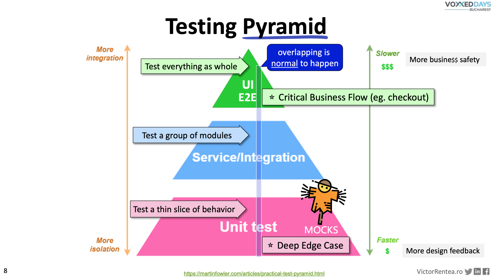
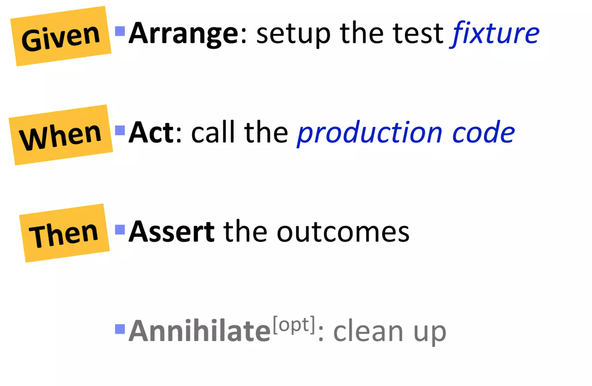
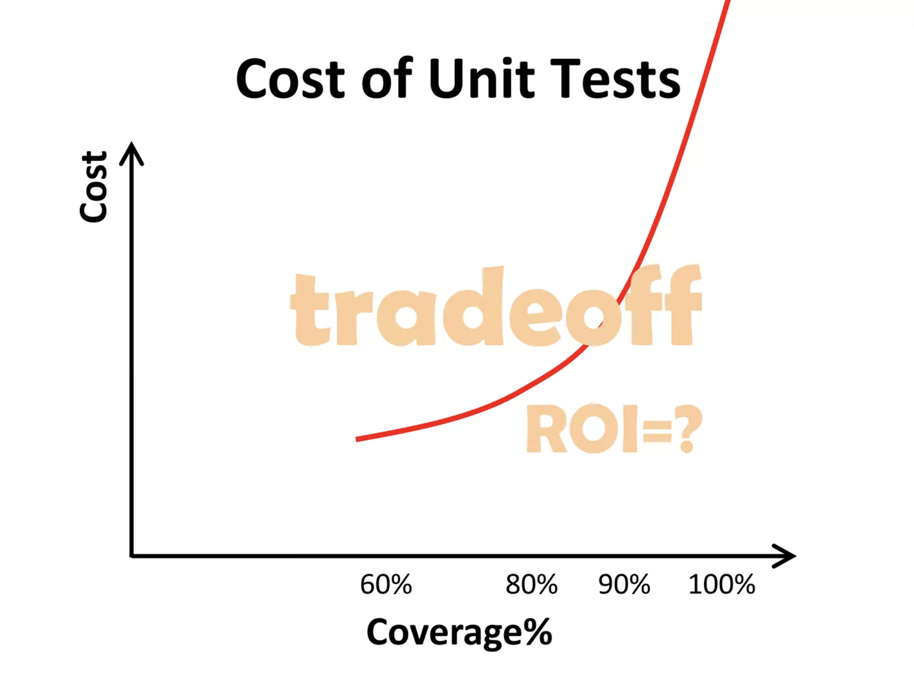
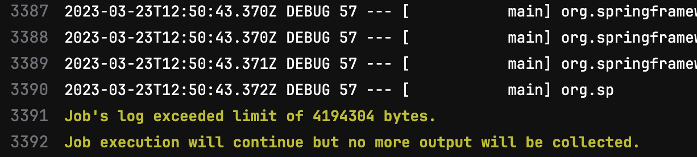
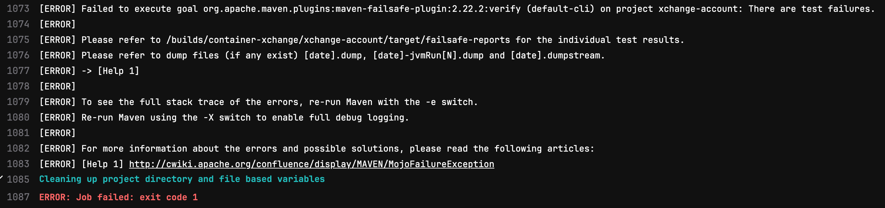
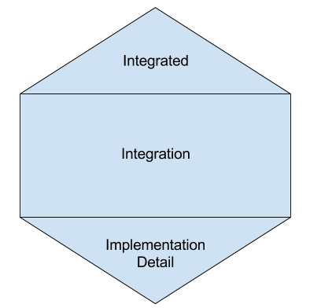

# Testing Guidelines

Testing is an essential part of software development that helps ensure that applications work as intended and meet
the expectations of users.
Additionally, they help colleagues to work on code that they might not be 110%
familiar with by indicating that modules and components still work as intended after changes are applied.

We read code 10x more times than we write.
Something written in 5 minutes will be read for almost an hour.
Think about this next time you will spend hours coding.
Tests help us write much more readable code — they shift attention from
implementation to usability, which ends up in much more simple code.
Don’t confuse this with "easy."
Writing good tests and code is not easy.
It requires practice.
Constant practice.

The true cost of software is in its maintenance.
We’re getting inevitably slower as the code degrades over time.
Tests enable us to ease the pain of maintenance by turning it into a simple routine activity.
Well-written tests enable change.
They enable options.

Tests are never obsolete, they act as a living specification forever.

To help ensure that I develop high-quality software effectively, I assemble this guideline.

# Understand the Classic Testing Pyramid

It's all starts with the testing pyramid —
a testing strategy that emphasizes the importance of having a balanced mix of different types of
tests.
This includes unit tests, integration tests, and end-to-end tests.
The aim is to have a higher percentage of unit tests and a lower percentage of end-to-end tests to ensure faster
feedback loops and more robust code.



*$$$ - expensive tests, a lot of machinery and time are involved*

*$ - cheap tests, very little resources and time are required*

In this article, I will mainly focus on unit test with sprinkles of integration test.

### **References**

* [The Practical Test Pyramid](https://martinfowler.com/articles/practical-test-pyramid.html)

# Unit tests

## What is a _unit_?

Before I dive deep into technics and dos-and-don'ts, we have to come to terms with "What is a _unit_?".
> "Unit — an individual thing or person regarded as single and complete but which can also form an individual component
> of a larger or more complex whole."— Google a.k.a.
> Oxford dictionary

Interesting, but a bit is too broad.

How about this?

> "In computer programming, unit testing is a software testing method by which individual units
> of source code—sets of one or more computer program modules together with associated control data, usage procedures,
> and operating procedures—are tested to determine whether they are fit for use.
> It is a standard step in development and implementation approaches such as
> Agile."- https://en.wikipedia.org/wiki/Unit_testing

Noticed anything strange?
There's nothing about a "single line of code", a "single method" or even a "single class".
This is one of the most common misconceptions.
Somehow unit is always associated with "a method" or even worse — "a line of code".
And so unit testing becomes method testing, line testing, etc.
This is very one-denominational are crude.
Yes, it's important for every method and every line of code to be tested,
but it should also make sense in the grand schema of things.

Allow me to elaborate.
If I'm building a feature (whatever it might be), what is more important?

- for the feature to work
- for some method to return the right value

Well, the answer is evident — it's always more important for the **feature** to work than for code to work.
Code can have mistakes, but if the features perform as it should - is this really a problem?
No, but... this is because the feature is the unit in this case.
Not a method or a line of code.
Code is just an implementation detail of this feature.
Important detail, but a detail nonetheless.
And details should be tested as part of something bigger.

This realization made unit testing my best ally, instead of a chore.

It's like LEGO.
Is it important that all bricks are working?
Yes.
But will the satisfaction be the same if instead of a pirate ship,
you will receive just a bunch of working bricks?
I doubt so.

## Write Effective Unit Tests

Here's my collection of technics and best practices for writing awesome unit tests.

### Listen to your unit tests

Your unit tests are trying to tell you something.
They are your allies.
“If tests are hard to write, the production design is crappy” - goes an old saying.
Indeed, writing unit tests gives one of the most comprehensive,
yet brutal feedback about the design of the production code.

#### Testable Design is Good Design


Having to mock more than five dependencies is a sign of a bad production code design.
Reconsider!
It's better to have ten small classes with one-two dependencies each,
than one mega-class with ten dependencies.
The ideal number of dependencies per class is zero, but this is hardly possible,
but the intention to have as few dependencies per class as possible should drive the design.

#### Testing simplification is a great reason to refactor production code

### Test behavior, not implementation

This is big.

This took me too long to realize — "Tests should not break when refactoring internals."

If I want to perform some minor refactoring(tidying),
like rearrange methods, classes, extract new interfaces — the behavior should stay the same.
Same behavior is equals no failing unit test, right?
This is impossible if tests are written for each method/line of code.
Tests should give freedom and options.
Not shackle.

Test the expected outcome (like return value, emitted events..) but
don’t verify the internals (like an order of mocks called, if not a vital part of the method).

This will apply stress the design of the code. Good.

Tests love [https://en.wikipedia.org/wiki/Pure_function](https://en.wikipedia.org/wiki/Pure_function).
And so should you.
Avoid side effects in your code where possible.
Group and encapsulate side effects as deeply as possible.

### Tests enable refactoring

It’s impossible to refactor code without tests.
It’s dangerous, time-consuming, and error-prone.
It’s not fun.
The number one precondition to any refactoring is a strong test suite, and there’s no way around it.
Untested code cannot be adequately refactored.

Nobody writes clean code from scratch.
Not even the “strongest” programmers.
First, they write a small bit of dirty messy code to test a theory,
and then they refactor their code,
because "strong" programmers have an adequate test suite to support their messy code from the beginning.

### Keep your tests clean

The cleanliness of tests is arguably even more important than the clean “production” code.
Try to avoid any “crafty“ approaches.
Settle for standard tools and practices.
The best test is the simple test.  
**And stay away from reflection, kids.**

Tools like **PowerMock** are a solid sign that something is fundamentally wrong with the code.
Unless you are building a reflection-based framework of some sort, there should be no need for such tools.

**Bad:**

```
@BeforeEach
void setUp(){
  MockitoAnnotations.openMocks(this);
}
```

Deceiving. Hide unnecessary stubbing. Don’t do it.

**Good:**

```
@ExtendWith(MockitoExtension.class)
class WonderfulServiceTest{
...
}
```

Reveals unnecessary stubbing, makes tests more readable, and adds more Mockito magic (in this case, this is a good
thing).

**Bad:**

```
private SystemUnderTest underTest;

@Mock
private MockOfSomething mock;

@BeforeEach
void beforeEach() {
    underTest = new SystemUnderTest(mock);
}
```

**Good:**

```
@InjectMocks
private SystemUnderTest underTest;

@Mock
private MockOfSomething mock;
```

Clean. Less boilerplate code.

Messy unit tests possess much greater risk than the absence of tests.
They create fake coverage and mislead into the idea that the code is working.

Review and refactor tests regularly.
Just like production code, tests should be reviewed and refactored regularly to
ensure that they are still valid and maintainable.
This includes removing redundant tests, consolidating duplicate
tests, and improving test readability.

### **Keep your tests small and focused**

Follow the AAA pattern (Arrange, Act, Assert)/GWT pattern (Given, When, Then)



### Test what’s important first

1. Code that you fear, happy paths  
   This should be your primary objectives.
   The first test is the hardest to write, and as soon as you crack it -
   everything else will fall apart with ease.

2. Deeply encapsulated logic that is hard to reach via the interface (API)  
   The logic that requires a lot of state management.
   Sometimes it's not possible to test the whole feature in isolation.
   Test it method by method.
   Fine.

3. A bug.  
   Every time you write a failing test that proves the bug before fixing that bug - you deserve a small salary raise.
   This is what truly differentiates the best from the rest.
   Personally, I found this extremely satisfying to see my failed test prove a bug, just then to be fixed.
   Or even better, a test that should fail — passes, because the initial "bug" assumption was wrong.

4. Validation. Places with high cyclomatic complexity.  
   `if`, `for`, `while`, etc.

5. Exceptional cases  
   All your `throws` and `try catch`.
   Test it, but maybe a bit later.

6. Facade methods. Methods that just call another method or two.  
   If you have time - do it.
   What are the chances that someone will accidentally delete one of those calls?
   These methods usually could be tested in a bundle with some other logical parts.

7. Trivial code. Getters/Setters.  
   Not the best way to increase code coverage.
   Same as for the facade methods — your getters/setters/mappers should be tested as part of something more meaningful.

8. Legacy code that never changes with no bugs.  
   If it works, don’t touch it.
   Leave it be.
   Find something better to do.

Don’t start testing by passing `null` and empty collections.
Don’t start testing with extremely rare edge cases.
Focus on what’s important first.
Use code coverage to detect missed paths.

Don’t strive to have high code coverage for the manager's sake.

#### Strive to have meaningful tests that you trust with your life

[Pareto principle](https://en.wikipedia.org/wiki/Pareto_principle) applies to tests quite well.
80% coverage could be archived by spending just a little bit of effort.
The last 20% of coverage will take you four times more effort.



### **Keep your unit tests fast**

*Ludicrously* fast.
Run unit tests often.
Run unit tests all the time.  
Keep in mind that unit tests are focussing on behavior.
Timing and concurrency should never be a part of the unit test — otherwise,
you end up with non-deterministic results.

* No `Thread.sleep(..)`.

* No [http://www.awaitility.org/](http://www.awaitility.org/).

* No `while(...){...}`

Keep these technics for integration tests.
Actively look for slow unit tests and investigate.
The usual suspects are Reflection and his best friend Mockin Static.
To fight with the `static` disease - convert `static` methods into small instanced components.

**Bad:**

```
public class SomethingSometingUtil {
  private SomethingSometingUtil(){ //look ma, I know about default constructor
  }

  public static Something convert(SomethingElse somethingElse){
    Something something = new Something();
    something.setSomeField(somethingElse.getSomeField());
    return something;
  }
}
```

The only way to mock this is via `Mockito.staticMock(SomethingSometingUtil.class)`
or tools such as `PowerMockito`.
This slows down tests considerably and makes them hard to work with.
Overall, `static` is considered _by me_ to be a terrible practice.

**Good:**

```
@Component
public class SomethingSomethingConverter {
  public Something convert(SomethingElse somethingElse){
    return SomethingSometingUtil.convert(somethingElse);
  }
}
```

In case it is impossible to refactor (and get rid of) `SomethingSometingUtil` in one go(3rd party library, too heavily
used in production code),
it is perfectly fine to introduce a decorator-ish component that wraps static nonsense.
The new component could be easily mocked, controlled, and tested.
This speeds up tests considerably and makes the code much cleaner in general.

Although, some literature says that talking to a database or a queue during unit test is fine, I disagree.
I like to keep my unit tests simple, fast and away from the network.

### Keep your tests 100% deterministic

* No flakiness.

* No time dependence.  
  Avoid `Instance.now()`and such. Instead, create a small component and inject it ***everywhere*** you need a current
  date.

  ```
  @Component
  public class DateService { // naming is hard, but we can always change it
      public Instant getNow(){
          return Instant.now(); //static methods are a bad practice, by the way
      }
  }
  ```

  It could be easily mocked and tested.
  A thing of beauty.

* No network interaction

* Avoid concurrency and multithreading, unless this is your prime objective

### Use mocking judiciously

* Mock behavior, not data  
  **Bad:**

  ```
  MyBelovedDTO dto = mock(MyBelovedDTO.class);
  ```

  Why?
  I'm seeing this all the time, and every single time my reaction is "Why?".
  After all these years, I still don't understand.
  I missed a memo or something.
  There is probably a beautiful builder pattern hidden somewhere.
  Use it.
  There’s none?
  Add a builder pattern and use it.
  If there’s no access to the class(3rd party library), invest in creating a dedicated builder just for
  testing.  
  **Good:**

  ```
  MyBeloverDTO dto = new MyBeloverDTOBuilder() //builder could be a standalone class
                                 ...           //use builder setters
                                 .build();     //ugly target class is encapsulated
  ```

* Don't Mock Getters  
  Just don’t.

* Don't have Mocks return Mocks  
  Every time you do that, a fairy dies 🧚😢

* Overuse of mocks leads to brittle tests and code that is difficult to maintain

* It is perfectly fine to use _real_ classes instead of mocked interfaces.  
  Mocked interfaces are hard to change - every API change will break **ALL** tests.
  Do yourself a favor, and don't solidify interfaces between components prematurely.
  This is especially true in the early stages of development.
  Mock a bit further from the class you are testing, and leave yourself room to wiggle.
  Or even better - start with an integration test.

  Assuming we have something like:

  ```
  @RequiredArgsConstructor
  class A {
      private final B b;
  
      public String getSomething() {
          return b.computeSomething();
      }
  }
  
  @RequiredArgsConstructor
  class B {
      private final CRepository cRepository;
  
      public String computeSomething() {
          return cRepository.getSomething() + " World!";
      }
  }
  
  class CRepository {
      // represention of a database
      public String getSomething() {
          return "Hello";
      }
  }
  ```

  Class **A** injects class **B**, class **B** injects class **CRepository**. Nothing crazy.

  **Might be too fragile:**

  ```
  @ExtendWith(MockitoExtension.class)
  public class ATest {
  
      @InjectMocks
      private A a;
      
      @Mock
      private B b;
  
      @Test
      void test() {
          when(b.computeSomething()).thenReturn("Hello World!");
          String actual = a.getSomething();
          assertEquals("Hello World!", actual);
      }
  }
  ```

  The interface between **A** and **B** is effectively locked.
  The only change we can do without breaking the test is renaming via IDE.
  It's useful, but nothing spectacular.

  **Might be more elastic:**

  ```
  @ExtendWith(MockitoExtension.class)
  public class ATest {
      
      private A a;
      
      @InjectMocks
      private B b;
      
      @Mock
      private CRepository cRepository;
  
      @BeforeEach
      void setUp() {
          a = new A(b); //real implementation of B is injected
      }
      
      @Test
      void test() {
          when(cRepository.getSomething()).thenReturn("Hello");
          String actual = a.getSomething();
          assertEquals("Hello World!", actual);
      }
  }
  ```

  The interface between **A** and **B** could be freely changed in any direction.
  Much more flexible approach.
  But this does not mean that interface of the **B** should always be fluent.
  As soon as the API of class **B** is getting more mature (ready to be merged into mainline) it makes sense to
  “solidify” it by adding **more** unit tests.

If you're using a framework with a dependency injection mechanism,
you probably can specify the set of dependencies to include in test.

This is how Spring does it:

```java

@ExtendWith(SpringExtension.class) // Enables Spring to take control over the test execution
@Import({A.class, B.class}) //classes that will be included into the test Spring Context
public class ATest {

    @Autowire
    private A a; //A will be instantiated by Spring
    //B will be injected automatically
    @MockBean
    private CRepository cRepository; //Mock of CRepository will be injected into B

    @Test
    void test() {
        when(cRepository.getSomething()).thenReturn("Hello");
        String actual = a.getSomething();
        assertEquals("Hello World!", actual);
    }
}
```

But be careful, you're still locking quite a bit of components together.
Plus, such tests are a bit slower, than "pure" jUnit tests due to Spring Context overhead.
It's not by much, but when we're talking about thousands and thousands of unit tests - every second count.

### **Avoid ArgumentMatchers**

Avoid usage of `any()` or similar vague matchers.
You should have a pretty good idea of what the parameter is, and can use a specific value instead.  
And in case you don’t know, you can capture the actual parameter
via [@ArgumentCaptors](https://www.baeldung.com/mockito-argumentcaptor) and apply the usual assertions on it.

**Bad:**

```
underTest.returningVoidIsABadPractice(veryCoolInputData); //calling a real method
verify(mock).veryCoolMethodIWantToTest(any());
```

Extremely deceiving test creating a _fake_ code coverage.
Better to have no test than this.
Honestly.

**Good:**

```
underTest.returningVoidIsABadPractice(veryCoolInputData); //calling a real method

ExpectedObjectType expectedObject = ExpectedObjectType.builder()
                                    .setId(123L)
                                    .build();
verify(mock).veryCoolMethodIWantToTest(expectedObject);
```

Best case scenario.
Objects will be compared using `.equals(Object object)`.
A much more flexible solution.
In case new fields are added to `ExpectedObjectType`, this test will automatically reveal all discrepancies
in `underTest.returningVoidIsABadPractice(...)` implementation.
Isn't this awesome?

**or**

```
@Captor
private ArgumentCaptor<ExpectedObjectType> expectedObjectCaptor;
...

underTest.returningVoidIsABadPractice(veryCoolInputData); //calling a real method

verify(mock).veryCoolMethodIWantToTest(expectedObjectCaptor.capture());
ExpectedObjectType expectedObject = expectedObjectCaptor.getValue();
asserEquals(123L, expectedObject.getId());
```

Sometimes there’s no `.equals(Object object)`implementation (3rd party library).
So we have to compare objects field by field manually.
Less flexible solution.

**or**

```
underTest.returningVoidIsABadPractice(veryCoolInputData);

verify(mock).veryCoolMethodIWantToTest(assertArg(expectedObject -> {
    assertEquals(123L, expectedObject.getId());
    assertEquals("Object title", expectedObject.getTitle());
}));
```

Slicker and up-to-date replacement for ArgumentCaptor.
Available since [Mockito v5.3.0](https://github.com/mockito/mockito/releases/tag/v5.3.0).

### **Never couple unit tests**

The execution order of tests is non-deterministic, they even might run in parallel.
Avoid any sort of `static` constructions in your tests.

**Bad:**

```
private static List<String> names = new ArrayList<>();


@Test
void testNamesEmpty(){
  assertTrue(names.isEmpty());
}

@Test
void testNamesNotEmpty(){
  names.add("John Doe");
  assertFalse(names.isEmpty());
}

```

Variable `List<String> names` is shared between all tests.
Changing the order of execution will change the output.
Avoid like a plague.

**Good**:

```
private List<String> names = new ArrayList<>(); 

@Test
void testNamesEmpty(){
  assertTrue(names.isEmpty());
}

@Test
void testNamesNotEmpty(){
  names.add("John Doe");
  assertFalse(names.isEmpty());
}
```

For each `@Test` new instance of the test class is created,
therefore instance variable `List<String> names` will not be shared.

### Have many test classes per production class

Do not feel compelled to stuff all your tests for `FooService` into `FooServiceTest`  
Every test that needs a slightly different setup should go into a separate test class.  
It helps understand what exactly going on in a test class.
For example, `FooServiceUserNotFoundExceptionTest` requires little to no explanations.

* Not sure about where to put new tests? Create a new class.

* The test class is getting too big and requires a lot of doom-scrolling?
  Split it into several test classes.
  This is also a good indicator that class under the test is too big with too many responsibilities.
  Refactor it.
  Split it into smaller pieces.

### Control the output of your tests

Green test should produce no output.  
Red test should produce just enough clear output.

**Bad and absolutely useless log:**



Good luck finding anything there.

**Good(but not perfect, too much output from Maven) output of the failing test suite:**



A simple browser search will reveal all the necessary information.

### Write unit tests early

Writing fine-grained unit tests early increases friction with bad design, helps to understand the problem and clarify
business requirements early in development, gives early design feedback, and produces real test coverage.

Unit tests force us to think about a piece of code from the user’s perspective.
This coerces a cleaner and more effective design.

Writing unit tests after the implementation is done is practically useless.
All mistakes are already made.
Bad design decisions as well.
Unit tests will just "solidify" everything.

I'm not preaching about TDD.
TDD is hard.
But writing unit tests early is not.
How early?
As early as possible.
Ideally, first 😉

Write a little bit of code, then write a little bit of test, then write a little bit of code, etc.
Next time, skip the first step.

### Eliminate everything that makes input and output unclear

* Never generate random input

* Don’t use named constants from the production code.
  What if there’s a type-o?  
  Prefer literal strings and numbers.
  Even when it means duplication.

### Keep assertions simple

* Too many assertions make tests difficult to read, maintain and blur the overall picture

* Strive to have one `assert...` per test for maximum readability

* Avoid any sort of conditional logic or logic in general in your assertions.
  Otherwise, you’ll have to write tests to test your tests.

  **Bad:**

  ```
  assertEquals("Hello"+expectedPersonName, actualGreeting);
  ```

  Even the simplest logic, like string concatenation, can produce errors.
  Have you noticed the missing (space) after “Hello”?
  Users will notice.  
  **Good:**

  ```
  assertEquals("Hello John Doe", actualGreeting);
  ```

  Leave no room for errors.
  At least, in unit tests.

* Be mindful of what is actually going on behind `assertEquals()`  
  It is not the best suitable to test collections.
  Use [https://assertj.github.io/doc/](https://assertj.github.io/doc/) `.contains()`, `.containsExactly()`, `.containsExactlyInAnyOrder()`,
  etc. instead.
  Don’t over-abuse AssertJ, as it leads to overly complex tests.
  Use simple standard assertions where possible.

    * Assertions should not be smart

    * **Assertions should be simple**

* Use `assertAll()` to see the whole picture.  
  **Bad:**

  ```
  assertEquals(123L, actual.getId());
  assertEquals("John", actualy.getName());
  assertEquals("Doe", actualy.getSurname());
  ... //20 more asserts, awful
  ```

  The first failed `assert...` will interrupt the test, and you will see only a part of the picture.  
  **Good:**

  ```
  assertAll(
  ()->assertEquals(123L, actual.getId()),
  ()->assertEquals("John", actualy.getName()),
  ()->assertEquals("Doe", actualy.getSurname()),
  ... //20 more asserts, still awful
  );
  ```

  `assertAll(...)` will run all executables(asserts) and produce a combined output. You will see the full picture.
  Although the test itself is starting to look rather ugly.

* Use the assert message parameter to help future you understand what exactly is going on.  
  `assertEquals(expected.getId(), actual.getId(), "User Id")` ← every `assert..` method actually has n+1 parameters, but
  everyone uses an overloaded version.
  It accepts not only a `String` but also a `Supplier<String>`.
  Even the simplest predefined message is much better than `AssertionFailedError: Expected 1 Actual 2`.
  Good luck deciphering that in three months.

You want your test to convey you a story about what is going on with the systems.
Just enough to spot the issue when it occurs.

### See your tests fail at least once

Make sure that your tests are actually testing something.
You should see your tests fail before they succeed.

Be curious, change the production code, see your test fail, confirm the error, and fix it back.
It virtually takes no time, and comforts you during the night.

The earlier you write unit tests, the simpler this could be achieved.
It's tough to write failing unit tests for already written code.

### **References**

* [https://www.baeldung.com/java-unit-testing-best-practices](https://www.baeldung.com/java-unit-testing-best-practices)

* [https://junit.org/junit5/docs/current/user-guide/](https://junit.org/junit5/docs/current/user-guide/)

* [https://understandlegacycode.com/blog/key-points-of-working-effectively-with-legacy-code/](https://understandlegacycode.com/blog/key-points-of-working-effectively-with-legacy-code/)

* [https://www.baeldung.com/mockito-argumentcaptor](https://www.baeldung.com/mockito-argumentcaptor)

* [Mock Roles, not Objects](http://jmock.org/oopsla2004.pdf)

* [https://assertj.github.io/doc/](https://assertj.github.io/doc/)

* [https://en.wikipedia.org/wiki/Mutation\_testing](https://en.wikipedia.org/wiki/Mutation_testing)

# Practice Parameterized Testing

Parameterized testing is a technique used to run the same test method with different input parameters.
This helps reduce code duplication and ensures that our code works as expected with different inputs.
Practice parameterized testing to improve the efficiency of tests and increase test coverage.

### **References**

* [Parameterized Tests with JUnit 5](https://www.baeldung.com/parameterized-tests-junit-5)

# Follow Extreme Programming Practices

Extreme Programming (XP) is an agile software development methodology that emphasizes testing as a core practice.
We should follow XP practices such as:

### **Continuous Integration**

Integrate your code into mainline frequently, avoid branching for too long

### **Pair Programming**

If something is even 1% over your comfort zone - ask for help

### **Continuous refactoring**

Don’t ever push code unless it is worthy to be added to your CV

### **Test-first**

Don’t even put code in visible sight unless it has a reasonably good unit test suite

### **References**

* [Extreme Programming](https://en.wikipedia.org/wiki/Extreme_programming)

* [https://amzn.eu/d/4riNe3l](https://amzn.eu/d/4riNe3l)

# Use Architectural Testing

Architectural testing is a technique used to verify that our code follows certain architectural rules and constraints.
We should use architectural testing to ensure that our code is scalable, maintainable, and follows best practices.

Architectural tests are extremely useful for preserving(or forcing) project structure. For example:

* prevent injecting repositories directly into the controller

* forbid accessing internal implementation of the module directly, and force usage of the API-layer

Overall, architectural tests should be quite deep in your toolbox.
Don’t just wave it left and right.

### **References**

* [ArchUnit](https://www.archunit.org/)

# Write Effective Microservice Integration Tests


Integration testing is essential for ensuring that different systems work together seamlessly to deliver the
expected functionality to end-users.
Effective microservice integration testing requires a thoughtful approach that takes into account the different
dependencies and interactions between the microservices.

One effective strategy for microservice integration testing is the Honeycomb Testing Strategy, which involves testing
the entire microservice in isolation using mocks to simulate external dependencies.
This strategy allows you to test the microservice in a controlled environment and catch any issues early on in the
development cycle.

### **Use Honeycomb Testing Strategy**



* Write a lot of integration tests

* “Attack” complex isolated parts with unit tests

* Sprinkle some system e2e tests on top

### **Test the entire microservice in isolation**

Use [https://wiremock.org/](https://wiremock.org/)/[https://www.mock-server.com/](https://www.mock-server.com/)
and [https://www.testcontainers.org/](https://www.testcontainers.org/) to mock/emulate **all** external dependencies

### **Start up the entire system (@SpringBootTest)** ***without internal Mocks***

* Reuse the test setup and Spring Application Context as much as possible by introducing the base test class with all
  the necessary fixtures to start the service.

* Be careful about shared stateful parts, like DB, Kafka, RabbitMQ, etc. Clean them **@BeforeEach/@BeforeAll** if
  necessary.  
  Pro tip: cleaning state BEFORE the test provides you with a better debugging experience.

### **Test as many end-to-end flows in your system as possible**

In order of importance:

1. Test the service as a whole via its interfaces - REST, Async, etc. Treat your service as a black box.

2. Afterward, test integrations (like DB, 3rd party services, S3, etc) in isolation if necessary.

### **Use unit tests to cover the parts of the code naturally isolated with high internal complexity**

Mocks are allowed.

### **Run integration separately from unit tests**

Use the [maven failsafe plugin](https://maven.apache.org/surefire/maven-failsafe-plugin/) or similar to separate slow
integration tests from blazing-fast unit tests.

Your goal should be to receive as much feedback as quickly as possible.

### **References**

* [https://engineering.atspotify.com/2018/01/testing-of-microservices/](https://engineering.atspotify.com/2018/01/testing-of-microservices/)

* [https://www.testcontainers.org/](https://www.testcontainers.org/)

* [https://www.youtube.com/watch?v=0kXEwo0XFaY](https://www.youtube.com/watch?v=0kXEwo0XFaY)

* [https://wiremock.org/](https://wiremock.org/)

* [https://www.mock-server.com/](https://www.mock-server.com/)

* [https://maven.apache.org/surefire/maven-failsafe-plugin/](https://maven.apache.org/surefire/maven-failsafe-plugin/)

* [Example BDD Test Setup on Account Service](https://gitlab.com/container-xchange/xchange-account/-/tree/main/src/test/java/de/xchange/account/bdd)

# Avoid fake test coverage

* Test coverage is a useful metric that can help **identify** untested code paths

* Test coverage is **just a metric**, and **should not** be the sole purpose of writing tests

* Writing tests solely to increase test coverage can lead to dangerous **"fake"** or **meaningless** coverage, where
  tests are written to simply execute the code paths with no actually asserting or verifying results

* Fake coverage leads to a **false** sense of security, where developers think they have thoroughly tested their code
  when in reality they are not

* Using tools like Sonar or other static code analyzers **can help** identify missed execution paths, but they **should
  not** be used to enforce writing tests for the sake of coverage

* Focus on writing tests that **actually** **test** **functionality** and ensure that code is working as expected,
  rather than just trying to increase test coverage

* Good test coverage alone **does not** guarantee the quality or correctness of code

* **It is better to have no test coverage, than a fake one.** With no coverage, at least, there is an incentive to write
  tests

### How to identify “fake” tests?

* **Try to break the test** - If the only way to break the test is to delete some lines of code, it might be a fake
  test

* **Vague argument matchers** - screams fake

* **Messy overly complex tests** - there’s a high probability, that some coverage is fake

* **Tests without any meaningful assertions or verifications** - 100% fake

* **Tests that test getters and setters** - it’s not fake, but a horrible way to increase the test coverage

* **Tests that do not follow testing guidelines (not a recommendation) -** most certainly
  fake 

# Other materials

* [https://www.youtube.com/watch?v=1Z\_h55jMe-M](https://www.youtube.com/watch?v=1Z_h55jMe-M) - must watch, if you’re
  not familiar with Victor Rentea - welcome to the club, buddy

* [https://www.youtube.com/watch?v=fr1E9aVnBxw](https://www.youtube.com/watch?v=fr1E9aVnBxw)

* [https://www.youtube.com/watch?v=F8Gc8Nwf0yk](https://www.youtube.com/watch?v=F8Gc8Nwf0yk)

* [https://amzn.eu/d/bLybGSN](https://amzn.eu/d/bLybGSN) - absolute classic, must-read, testing covered in Chapter 9

* [https://amzn.eu/d/48lnk1H](https://amzn.eu/d/48lnk1H) - amazing book about by one and only Martin Fowler. Must read.

…to be continued
