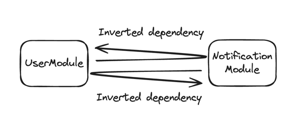
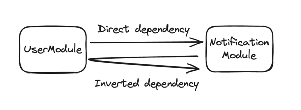
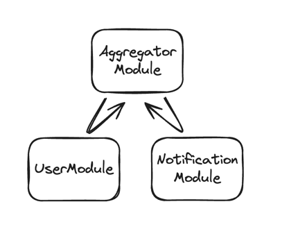
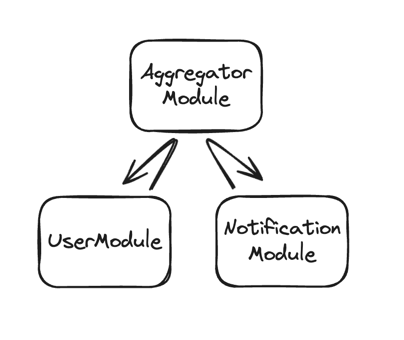
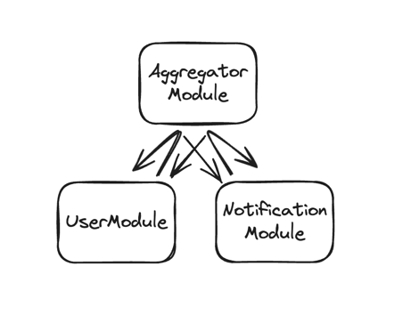

> "I knew you'd say that" - Judge Dredd

After
publishing [Practical Dependency Inversion Principle](https://www.buyallmemes.com/#practical-dependency-inversion-principle)
article, I received amazing feedback from one of my dear colleagues.

It was in the form of a question:
> ...there is another problem, the cross-dependency between modules/packages.
>
>What are your thoughts on this?

The question was premised on the schema that looks like this:



With code structure like this:

```bash
├── test
│   ├── notification
│   │   ├── NotificationUser.java
│   │   ├── NotificationUserRetriever.java
│   │   └── NotificationModule.java
│   ├── user
│   │   ├── UserModule.java
│   │   ├── UserNotificationRetriever.java
│   │   └── UserNotification.java

```

Where `NotificationModule` implements `UserNotificationRetriever` and `UserModule`
implements `NotificationUserRetriever`.

It's not that hard to imagine:

- `NotificationModule` wants to know something about a user, and the dependency on `UserModule` is inverted, exactly as
  it should be
- `UserModule` needs something from `NotificationModule`, and the dependency is also inverted

This is what's called **Circular Dependency**.

And it's extremely problematic.
Dependency Inversion ultimately plays no role here,
even with direct uninverted dependencies such a case can occur,
and the Dependency Inversion Principle by itself cannot fix it.
Some frameworks (like Spring) and build tools (like Maven) will produce an error in case even a single
circular dependency is detected.
The main reason is — it's just too dangerous to resolve.
It's a recursion.
Unless treated with care it can produce such nice things like `out-of-memory`, `stackoverflow`, etc.

But, more than anything, it reveals the fundamental flaw in the system design.

In this article, I'm going to share some tips-and-tricks on how to treat circular dependencies.
And I'm going to start with the most radical one.

## Tactical Merge

Yes, I know.
You are your colleagues spent weeks and months trying to separate `UserModule` and `NotificationModule`.
You might have even extracted them into systems separated by the network to enforce sacred _domain boundaries_.
And now I'm suggesting to move everything back together into a single `SpaghettiModule`?
Hell no!

Hear me out.
The software is supposed to be... soft.
Flexible.
Like clay.
The purpose of the software is to help businesses achieve their needs.
If the software is designed in a way that does not allow developers to build certain features effectively -
the design is a massive failure.
At the end of the day, most product companies are **not** selling their software directly,
but rather via a service that software implements a.k.a. SaaS.
I think we can agree on that.

For example, do you care about the system design behind a _google.com_?
If you're a nerd, maybe.
A regular person cannot care less about the underlying software.
But everyone cares about this software working.
Everyone.

So yeah, if `UserModule` and `NotificationModule` want to be together,
because business requirements want so, it's probably a good idea to consider merging them,
and reshaping into a single domain.
Don't feel overprotected by existing boundaries.
Sometimes mistakes are made, and the worst thing we as engineers can do is to be stubborn about it.

It's a very humbling experience.
You should try it.

## One direction

A less radical,
but a bit more political approach is to invert dependency only from one module to another,
and leave the direct dependency from another module back.

For example, we decide that `NotificationModule` is the high-level module,
and `UserModule` is... well, further from the core of the business logic.
This is where the political card has to be played
because the team that manages `UserModule` might not agree on doubling down on `NotificationModule` dependency:



With the code structure like this:

```bash
├── test
│   ├── notification
│   │   ├── NotificationUser.java
│   │   ├── NotificationUserRetriever.java
│   │   └── NotificationModule.java
│   ├── user
│   │   ├── UserModule.java
```

And so there we have it.
`UserModule` directly depends on `NotificationModule`,
and there's an inverted dependency from `UserModule` to `NotificationModule`.
The dependency cycle no longer exists.
At least, during build time.
There's still the possibility of an infinite loop during a **runtime**:

- `NotificationModule` invokes a `NotificationUserRetriever` interface that's implemented within `UserModule`
- To implement `NotificationUserRetriever` `UserModule` needs something from `NotificationModule` and so it calls it
  directly

This is more like a hack or remedying the symptoms.
The disease is still there.
Modules are still tightly coupled.
Domain boundaries are wrong.
We just tricked the system.

To solve this problem once and for all, one of the dependencies has to be broken.
The best-case scenario is that both of them no longer exist.

However, there are ways to break circular dependencies via some integration patterns.
**Queue** is the first thing that comes to my mind.
Is it possible to eliminate the dependencies altogether by listening to a message queue?
Or maybe something a bit more robust, like a Kafka topic?
Sounds great!
Don't.
It's even more dangerous.

Let's go through a "hypothetical" example:

- `NotificationModule` receives a request from out there, and after fulfilling the request, it emits an event
  to `UserModule`
- `UserModule` receives an event, performs some computation, updates some user data... and sends an event
  to `NotificationModule`
- But, unfortunately, when `NotificationModule` receives an event, and after performing some computation, it decides to
  notify `UserModule` via event

You can see where it's going.
The system ends up in an asynchronous loop of events exchange that never terminates.
It might go for days and weeks unnoticed.
Until, eventually, with more and more requests triggering infinite loops,
the whole system will grind to a halt and go OOM.

Been there. Done that.

## Extract new module

This is a tricky one because it's very easy to get it wrong and make things worse.

The approach is to extract functionalities that produce circular dependencies into a new even more high-level module.
And invert the dependency from it.



The code structure:

```bash
├── test
│   ├── aggregator
│   │   ├── AggregatorUser.java
│   │   ├── AggregatorUserRetriever.java
│   │   │  
│   │   ├── AggregatorNotification.java
│   │   ├── AggregatorNotificationRetriever.java
│   │   │
│   │   └── AggregatorModule.java
│   ├── notification
│   │   └── NotificationModule.java
│   ├── user
│   │   └── UserModule.java

```

We're demoting `UserModule` and `NotificationModule` to a lower level of abstraction,
and introducing a new higher level `AggregatorModule` (naming is hard).

So that `NotificationModule` depends on `AggregatorModule`, and `UserModule` depends on `AggregatorModule`.
The nuance here is that `AggregatorModule` now exposes two interfaces,
but `NotificationModule` and `UserModule` can cover only one of those each,
so the setup requires more attention.

There are whole lots of tricks that could be applied to handle such a case:
from something like a combination of `@ConditionOnMissingBean(...)` and `@Primary` bean annotations
if we're talking about Spring Framework,
to something as simple as the default interface method.
And if you feel like there might be more modules
to depend on `AggregatorModule` it might be a good idea to introduce a generic aggregator interface.
This is where the real engineering begins.

This approach seems like a quite straightforward one.
What's easy to get wrong here?
I'm glad you asked.
And the answer is simple — direction of dependency inversion.
It might sound like a brilliant idea to introduce `AggregatorModule` and to make it depend on
both `UserModule` and `NotificationModule`:



With code structure like this:

```bash
├── test
│   ├── aggregator
│   │   └── AggregatorModule.java
│   ├── notification
│   │   ├── NotificationUser.java
│   │   ├── NotificationUserRetriever.java
│   │   └── NotificationModule.java
│   ├── user
│   │   ├── UserModule.java
│   │   ├── UserNotificationRetriever.java
│   │   └── UserNotification.java

```

`AggregatorModule` implements both interfaces.
`UserModule` and `NotificationModule` no longer know about each other.
Sounds great!
Except it's not.

Where `AggregatorModule` will get the information to implement `NotificationUserRetriever` for example?
From `UserModule` of course.
And what about `UserNotificationRetriever`, how to implement it?
Invoke `NotificationModule`.

So the more realistic dependency schema should look like this:



So instead of one circular dependency between `UserModule` and `NotificationModule`,
there are two, and they are even more distributed!
And, the best way to solve a problem is to distribute it.
COVID? Anyone?

So yeah, be careful.
In this case, inversion of dependency could do more harm than good.


And this is exactly why I started with the [Tactical Merge](#tactical-merge).
Although it seems like the most extreme, it guarantees to work.
The presence of circular dependency signals a fundamental issue with the design,
and addressing it only partially might provide temporary relief but won't offer lasting fix.

