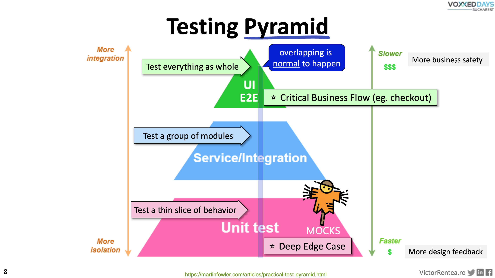
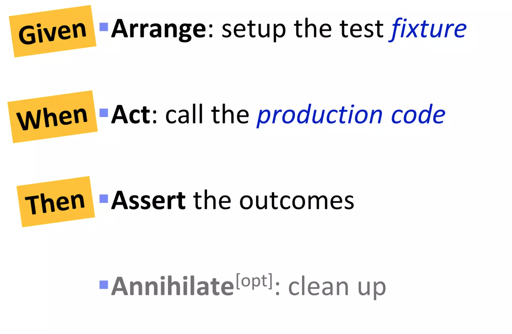
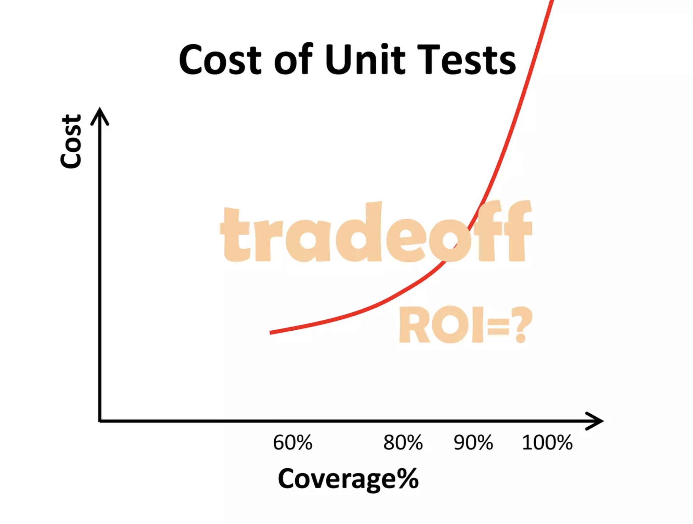
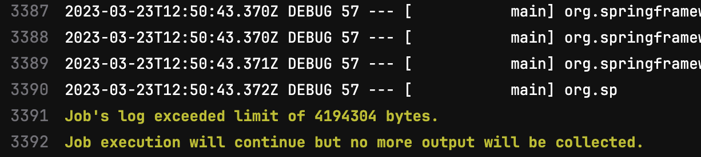
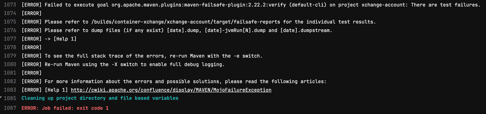
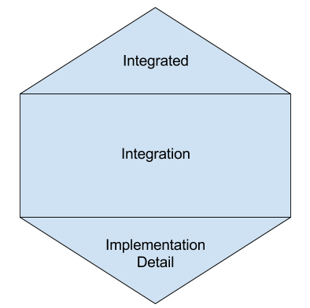

I wrote this article quite some time ago and parked it on the company's confluence page.

Although it was super exciting to write,
and I tried to promote it internally to the best of my ability,
it turned out to be yet another cold documentation.

But I liked it so much, that I think it's worth revisiting and publishing in the open.

# Testing

## Why test?

I think it's mostly clear, but nonetheless, I will outline a couple of the most important reasons.

### We want our software to work

Testing is an essential part of software development that helps ensure that an application works as intended and meets
the expectations of users.
Without tests, it's almost impossible to prove, that the functionality does what it's supposed to do -
it's just an educated guess.

### We want our software to continue working

The true cost of software is in its maintenance.
Time and money invested into maintenance dwarfs initial development investment.
And the larger the codebase, the less and less important the initial development investment cost is.
Maintainability should be the main factor when developing software.  
We’re getting inevitably slower as the code degrades over time.
Tests enable us to ease the pain of maintenance by turning it into a simple routine activity.  
Well-written tests enable change.
They enable options.

### People interaction

Counterintuitively, tests help with readability.
They shift attention from implementation details to behavior, usability, and user-friendliness,
which ends up in much more simple code.
We spend 10x more time reading code when writing.
Something written in ~5 minutes will be read for an hour.
Think about this next time you will spend hours coding.

Speaking in financial terms:
**code is a liability** — it is something that requires more and more investments over time to keep it working.
The larger the codebase, the more maintenance, bug fixing, and refactoring it requires.  
On the other hand, **test suite is your asset** — it is something that helps to deal with the liability.
Well-written test suite will continuously pay its dividends.  
And if financial gurus are teaching us something,
is that we should invest (time and money) in assets, and not liabilities.

Tests are never obsolete, they act as a living specification forever.

Don’t confuse anything of that with "easy."
Writing good tests and good code is not easy.
It requires discipline and practice.
Constant practice.

So let's go through the most important aspects that I picked up over the years of writing awesome tests one-by-one.

# Understand the Classic Testing Pyramid

It all starts with the testing pyramid —
a testing strategy that emphasizes the importance of having a balanced mix of different types of tests.
There are many types of tests, but they can be categorized into three groups:

* unit tests
* integration tests
* end-to-end tests

The aim is to have a higher percentage of unit tests and a lower percentage of end-to-end tests to ensure faster
feedback loops and more robust code.



*$$$ — expensive tests, a lot of machinery and time are involved*

*$ — cheap tests, very little resources and time are required*

In this article, I will mainly focus on unit tests with sprinkles of integration tests.

#### References

* [The Practical Test Pyramid](https://martinfowler.com/articles/practical-test-pyramid.html)

# Unit tests

## What is a _unit_?

Before I dive deep into technics and dos-and-don'ts, we have to come to terms with "What is a _unit_?".
> "Unit — an individual thing or person regarded as single and complete but which can also form an individual component
> of a larger or more complex whole."— Google a.k.a.
> Oxford dictionary

Interesting, but a bit too broad.

How about this?

> "In computer programming, unit testing is a software testing method by which individual units
> of source code—sets of one or more computer program modules together with associated control data, usage procedures,
> and operating procedures—are tested to determine whether they are fit for use.
> It is a standard step in development and implementation approaches such as
> Agile."- https://en.wikipedia.org/wiki/Unit_testing

Noticed anything?  
There's nothing about a "single line of code," a "single method" or even a "single class."  
This is one of the most common misconceptions.
Somehow "unit" is commonly interpreted as "a method" or even worse — "a line of code."
And so unit testing becomes method testing, line testing, etc.  
This is very one-dimensional and crude.  
Yes, it's important for every method and every line of code to be tested,
but it should also make sense in the grand schema of things.

Allow me to elaborate.
If I'm introducing a change (whatever it might be: feature, bugfix, etc.), what is more important?

- for the change to work
- for some method to return the right value

Well, the answer is clear —
it's always more important for the whole **change** to work than for the method to return the right value.
Code can have mistakes, but if the change performs as it should - who cares?
This is because the change is the unit in this case.
Not a method or a line of code.
The code is just an implementation detail of this change.
Important detail, but a detail nonetheless.
And details should be tested as part of something bigger.

This realization made unit testing my best ally, instead of a chore.

It's like LEGO.
Is it important that all bricks are working?
Yes.
But will the satisfaction be the same if instead of a pirate ship,
you receive just a bunch of working bricks?
I doubt so.

## Write Effective Unit Tests

Here's my collection of techniques and best practices for writing awesome unit tests.
Don't get me wrong, I haven't invented any of those —
this is just a collection that I've assembled over time from different sources: be it books, articles, conference talks,
workshops, and my colleagues.

However, all this stuff is battle-tested.
There's not a single technique that I don't use daily.
If anything, there might be more.

Some of these points are asymptotes —
they are hardly reachable 100% of the time, and it's fine, as long as there's a consistent upward trend.

There are going to be quite a few code snippets, they all will be in **Java** with some sprinkles of **Spring**, for
obvious reasons 😏.

### Listen to your unit tests

Your unit tests are trying to tell you something, and if you want your code to be awesome, you have to listen.
They are your best allies.  
“If tests are hard to write, the production design is crappy” - goes an old saying.
Indeed, writing unit tests gives one of the most comprehensive,
yet brutal feedback about the design of the system.

From my experience,
every project where tests were treated like a chore or an afterthought had a horrible rotting codebase.
No exceptions.
And the best codebases I worked with were always backed up by an amazing testing culture amongst developers.
There's nothing that hurts codebase more than a phrase: "I'm finished with implementation, and now I'm writing tests."

And this brings us to the next point...

### Write unit tests early

Writing fine-grained unit tests early increases friction with bad design,
helps to understand the problem and clarify business requirements early in development,
gives early design feedback, and produces real test coverage.

Unit tests force the writer to think about a piece of code from the user’s perspective.
This coerces a cleaner and more effective design.

Writing unit tests after the implementation is done is practically useless.
All mistakes are already made.
Bad design decisions as well.
Unit tests will just "solidify" everything, and harm more than help.

I'm not preaching about TDD.
TDD is hard.
But writing unit tests early is not.
How early?
As early as possible.
Ideally, first 😉.  
Write a little bit of code, then write a little bit of test, then write a little bit of code, etc.
As soon as you feel comfortable, skip the first step.

### Testable Design is Good Design


Having to mock more than five plus dependencies is a sign of a bad production code design.

It's better to have ten small classes with one-two dependency each,
than one mega-class with ten dependencies.
The ideal number of dependencies per class is zero, but this is hardly possible,
but the intention to have as few dependencies per class as possible should drive the design.

#### **Testing simplification is a great reason to refactor production code**

I once heard a phrase from a seasoned dev: "Changing production code because of tests is a bad practice!" —
it goes without saying that the project codebase was one of the worst I ever worked with to this day.

The pinnacle of this project for me was a 4-week sprint,
during which my team was extremely busy, but managed to produce so little output,
that during the monthly project demo, all we had to show for it was a small green text on a couple of web pages.  
And nobody was laughing, because other teams(~15 in total) managed to produce even less.
A couple of months later, the project with a 20mil euro a year budget was canceled after approximately 4 years of
development.
The project was a massive failure.

It was probably mismanaged all over the place,
yes, but poor and unprofessional engineering "ship-shit-fast" culture didn't help,
that's for sure.
Over 4 years, more than a hundred engineers(myself included) produced nothing but a raw unmaintainable mess,
that inevitably ground development to a halt.

But I've learned a lot.
No matter how many hours I and my team put into a working week, the ever-growing mess will always outpace us.
And the only way to move fast is to move with ever-increasing quality.
And the only way to achieve ever-increasing quality is to mercilessly refactor existing code.
And the only way to enable refactoring is to have rigorous testing ethics.

**Moral of the story: good tests equal fast development.**

### Test behavior, not implementation

This is big.

This took me too long to realize.

#### Implementation changes should not break tests

If I want to perform some minor refactoring(tidying),
like rearranging methods, and classes, extracting new interfaces - something that keeps the behavior the same,
I should be able to do it without breaking tests.
This is impossible if tests are written to test implementation (each method/line of code).

My rule of thumb goes like this:
All the code I can merge into a single class without breaking the system and domain boundaries should be tested as
one.
The whole domain is a unit.

Assuming I have something like this:

```bash
├── buyallmemes
│   ├── notification
│   │   ├── NotificationUser.java
│   │   ├── NotificationUserRetriever.java
│   │   ├── NotificationUserMapper.java //maps something to something
│   │   ├── EmailGatewayClient.java // sends message to queue
│   │   ├── ... //domain specific logic
│   │   └── NotificationModule.java
│   ├── user
│   │   └──  UserModule.java //implements NotificationUserRetriever, retrieves a user from DB

```

There are several possibilities to scope tests:

- go by the "book" and test each class/method on its own mocking everything else
- scope tests around whole `NotificationModule` and mock only external dependencies

This way, dependencies within the scope could be refactored.
It's much more flexible.
API signatures could be changed freely.

### Tests enable refactoring

It’s impossible to refactor code without tests.
It’s dangerous, time-consuming, and error-prone.
It’s not fun.
The number one precondition to any refactoring is a strong test suite, and there’s no way around it.
Untested code cannot be adequately refactored.

And nobody writes clean code from scratch.
Not even the “strongest” programmers.
The "stronger" the programmer, the more he/she relies on an adequate test suite to support their messy code from the
beginning.

I've been guilty of refactoring without tests in the past.
It's a dreadful experience.

### Keep your tests clean

The cleanliness of tests is arguably even more important than the clean “production” code.
The code will inevitably change, it will evolve, and the only thing that will hold it accountable is tests.

Try to avoid any “crafty” approaches.
Settle for standard tools and practices.

#### The best test is the simple test

**Bad:**

```java

@BeforeEach
void setUp() {
    MockitoAnnotations.openMocks(this);
}
```

Deceiving. Hide unnecessary stubbing. Don’t do it.

**Good:**

```java

@ExtendWith(MockitoExtension.class)
class WonderfulServiceTest {
...
}
```

Reveals unnecessary stubbing, makes tests more readable, and adds more Mockito magic (in this case, this is a good
thing).

**Bad:**

```java
private SystemUnderTest underTest;

@Mock
private MockOfSomething mock;

@BeforeEach
void beforeEach() {
    underTest = new SystemUnderTest(mock);
}
```

**Good:**

```java

@InjectMocks
private SystemUnderTest underTest;

@Mock
private MockOfSomething mock;
```

Clean. Less boilerplate code.

Messy unit tests possess much greater risk than the absence of tests.
They create fake coverage and mislead into an idea that the code is working.

**And stay away from reflection.**

In Java world, tools like **PowerMock**,
**ReflectionUtils** are a solid sign that something is fundamentally wrong with the code design.
Unless you are building a reflection-based framework of some sort, there should be no need for such tools.

### Review and refactor tests regularly

Just like production code, tests should be reviewed and refactored to
ensure that they are still valid and maintainable.
This includes removing redundant tests, consolidating duplicate
tests, and improving test readability.

### Keep your tests small and focused

Follow the AAA pattern (Arrange, Act, Assert)/GWT pattern (Given, When, Then)



### Have many test classes per production class

Do not feel compelled to stuff all your tests for `FooService` into `FooServiceTest`.  
Every test that needs a slightly different setup should go into a separate test class.  
It helps to understand what exactly is going on in a test class.
For example, `FooServiceUserNotFoundExceptionTest` requires little to no explanations.

* Not sure about where to put new tests? Create a new class.

* The test class is getting too big and requires a lot of doom-scrolling?
  Split it into several test classes.
  This is also a good indicator that the class under the test is too big with too many responsibilities.
  Refactor it.
  Split it into smaller pieces.

Once again, **the best test is the simple test**

### Test what’s important first

1. Happy paths.  
   It's a good idea to start with something simple, something satisfying.

2. Code that you fear.  
   This should be your primary objective.
   The first test is the hardest to write, and as soon as you crack it -
   everything else will fall apart with ease.

3. Deeply encapsulated logic that is hard to reach via API.  
   The logic that requires a lot of state management.
   Sometimes it's not possible to test the whole change in isolation,
   and this is where "method by method" tests become useful.
   Don't overdo it.

4. A bug.  
   Every time you write a failing test that proves the bug before fixing that bug - you deserve a small salary raise.
   This is what truly differentiates the best from the rest.
   Personally, I found this extremely satisfying to see my failed test prove a bug, just then to be fixed.
   Or even better, a test that should fail — passes, because the initial "bug" assumption was wrong.
   I can't stress enough how powerful this technique is.

5. Validation.  
   Places with high cyclomatic complexity.  
   `if`, `for`, `while`, etc.

6. Exceptional cases.  
   All your `throws` and `try catch`.
   Test it, but maybe a bit later.

7. Facade methods.  
   Methods that just call another method or two.
   If you have time - do it.
   What are the chances that someone will accidentally delete one of those calls?
   These methods usually could be tested in a bundle with some other logical parts.

8. Trivial code.  
   Getters/Setters.
   Not the best way to increase code coverage.
   Same as for the facade methods — your getters/setters/mappers should be tested as part of something more meaningful.

9. Legacy code that never changes with no bugs.  
   If it works — don’t touch it.
   Leave it be.
   Find something better to do.

Don’t start testing by passing `null` and empty collections.  
Don’t start testing with extremely rare edge cases.  
Focus on what’s important first.  
Use code coverage to detect missed paths.

Don’t strive to have high code coverage for the manager's sake.

#### Strive to have meaningful tests that you trust with your life

[Pareto principle](https://en.wikipedia.org/wiki/Pareto_principle) applies to tests quite well.
80% coverage could be achieved by spending just a little bit of effort.
The last 20% of coverage will take you approximately four times as much.



### Keep your unit tests fast

*Ludicrously* fast.
Run unit tests often.
Run unit tests all the time.  
Keep in mind that unit tests are focussing on behavior.
Timing and concurrency should never be a part of the unit test — otherwise,
you end up with non-deterministic results.

* No `Thread.sleep(..)`.

* No [http://www.awaitility.org/](http://www.awaitility.org/).

* No `while(...){...}`

Keep these techniques for integration tests.

Actively look for slow unit tests and investigate.
The usual suspects are Reflection and his best friend Mockin Static.
To fight with the `static` disease - convert `static` methods into small instanced components.

**Bad:**

```java
public class SomethingSometingUtil {
    private SomethingSometingUtil() { //look ma, I know about default constructor
    }

    public static Something convert(SomethingElse somethingElse) {
        Something something = new Something();
        something.setSomeField(somethingElse.getSomeField());
        return something;
    }
}
```

The only way to mock this is via `Mockito.staticMock(SomethingSometingUtil.class)`
or tools such as `PowerMockito`.
This slows down tests considerably and makes them hard to work with.
Overall, `static` is considered _by me_ to be a terrible practice.

**Good:**

```java

@Component
public class SomethingSomethingConverter {
    public Something convert(SomethingElse somethingElse) {
        return SomethingSometingUtil.convert(somethingElse);
    }
}
```

In case it is impossible to refactor (and get rid of) `SomethingSometingUtil` in one go(3rd party library, too heavily
used in production code),
it is perfectly fine to introduce a decorator-ish component that wraps static nonsense.
The new component could be easily controlled, mocked, and tested.
This speeds up tests considerably and makes the code much cleaner in general.

Although some literature suggests that talking to a database or a queue during a unit test is fine, I disagree.
I like to keep my unit tests simple, fast, and away from the network.

### Keep your tests 100% deterministic

* No flakiness.

* No time dependence.  
  Avoid `Instance.now()`and such.
  Instead, create a small component and inject it **_everywhere_** you need a current
  date.

  ```java
  @Component
  public class DateService { // naming is hard, but we can always change it
      public Instant getNow(){
          return Instant.now(); //static methods are a bad practice, by the way
      }
  }
  ```

  It could be easily mocked and tested.
  A thing of beauty.

* No network interaction — the network is slow, avoid it

* Avoid concurrency and multithreading, unless this is your prime objective

### Use mocking judiciously

* Mock behavior, not data.  
  **Bad:**

  ```java
  MyBelovedDTO dto = mock(MyBelovedDTO.class);
  ```

  Why?
  I see this all the time, and every single time my reaction is "Why?"
  After all these years, I still don't understand.
  I probably missed a memo or something.
  In most cases, there's a beautiful builder pattern hidden somewhere.
  Use it.
  There’s none?
  Add a builder pattern and use it.
  If there’s no access to the source code(3rd party library), invest in creating a dedicated builder just for
  testing.  
  **Good:**

  ```java
  MyBeloverDTO dto = new MyBeloverDTOBuilder() //builder could be a standalone class
                                 ...           //use builder setters
                                 .build();     //ugly target class is encapsulated
  ```

* Don't Mock Getters.  
  Just don’t.

* Don't have Mocks return Mocks.  
  Every time you do that, a fairy dies 🧚😢

* Overuse of mocks leads to brittle tests and code that is difficult to maintain.

It is perfectly fine to use _real classes_ instead of mocked interfaces.  
Mocked interfaces are hard to change - every API change will break **ALL** tests.
Do yourself a favor, and don't solidify interfaces between components prematurely.
This is especially true in the early stages of development.
Mock a bit further from the class you are testing, and leave yourself room to wiggle.
Or even better - start with a small integration test.

Assuming we have something like:

  ```java

@RequiredArgsConstructor
class A {
    private final B b;

    public String getSomething() {
        return b.computeSomething();
    }
}

@RequiredArgsConstructor
class B {
    private final CRepository cRepository;

    public String computeSomething() {
        return cRepository.getSomething() + " World!";
    }
}

class CRepository {
    // represention of a database
    public String getSomething() {
        return "Hello";
    }
}
  ```

Class **A** injects class **B**, and class **B** injects class **CRepository**. Nothing crazy.

**Might be too fragile:**

```java

@ExtendWith(MockitoExtension.class)
public class ATest {

    @InjectMocks
    private A a;

    @Mock
    private B b;

    @Test
    void test() {
        when(b.computeSomething()).thenReturn("Hello World!");
        String actual = a.getSomething();
        assertEquals("Hello World!", actual);
    }
}
```

The interface between **A** and **B** is effectively locked.
The only change we can make without breaking the test is renaming via IDE.
It's useful, but nothing spectacular.

**Might be more elastic:**

```java

@ExtendWith(MockitoExtension.class)
public class ATest {

    private A a;

    @InjectMocks
    private B b;

    @Mock
    private CRepository cRepository;

    @BeforeEach
    void setUp() {
        a = new A(b); //real implementation of B is injected
    }

    @Test
    void test() {
        when(cRepository.getSomething()).thenReturn("Hello");
        String actual = a.getSomething();
        assertEquals("Hello World!", actual);
    }
}
```

The interface between **A** and **B** could be freely changed in any direction.
Much more flexible approach.
But this does not mean that the interface of the **B** should always be fluent.
As soon as the API of class **B** is getting more mature (ready to be merged into mainline) it _might_ make sense to
“solidify” it by adding **more** unit tests.
If you're using a framework with a dependency injection mechanism, you probably can specify the set of dependencies to
include in the test.  
This is how Spring does it:
```java

    @ExtendWith(SpringExtension.class) // Enables Spring to take control over the test execution
    @Import({A.class, B.class}) //classes that will be included into the test Spring Context
    public class ATest {
    
        @Autowire
        private A a; //A will be instantiated by Spring
        //B will be injected automatically
        @MockBean
        private CRepository cRepository; //Mock of CRepository will be injected into B
    
        @Test
        void test() {
            when(cRepository.getSomething()).thenReturn("Hello");
            String actual = a.getSomething();
            assertEquals("Hello World!", actual);
        }
    }
```

But be careful, you're still locking quite a bit of components together.
Plus, such tests are a bit slower than "pure" jUnit tests due to the Spring Context overhead.
It's not slower by much, but when we're talking about thousands and thousands of unit tests - every hundred milliseconds
count.

### Avoid ArgumentMatchers

Avoid usage of `any()` or similar vague matchers.
You should have a pretty good idea of what the parameter is and can use a specific value instead.  
And in case you don’t know, you can capture the actual parameter
via [@ArgumentCaptors](https://www.baeldung.com/mockito-argumentcaptor) and apply the usual assertions on it.

**Bad:**

```java
underTest.returningVoidIsABadPractice(veryCoolInputData); //calling a real method

verify(mock).veryCoolMethodIWantToTest(any()); //WTH is tested here?
```

Extremely deceiving test creating a _fake_ code coverage.
Better to have no test than this.
Honestly.

**Good:**

```java
underTest.returningVoidIsABadPractice(veryCoolInputData); //calling a real method

ExpectedObjectType expectedObject = ExpectedObjectType.builder()
                                                      .setId(123L)
                                                      .build(); //indirectly tests setters!

verify(mock).veryCoolMethodIWantToTest(expectedObject); //aaah, now it's clear
```

Best case scenario.
Objects will be compared using `.equals(Object object)`.
A much more flexible solution.
In case new fields are added to `ExpectedObjectType`, this test will automatically reveal all discrepancies
in `underTest.returningVoidIsABadPractice(...)` implementation.
Isn't this awesome?

**or**

```java

@Captor
private ArgumentCaptor<ExpectedObjectType> expectedObjectCaptor;

underTest.returningVoidIsABadPractice(veryCoolInputData); //calling a real method

verify(mock).veryCoolMethodIWantToTest(expectedObjectCaptor.capture());
ExpectedObjectType expectedObject = expectedObjectCaptor.getValue();

asserEquals(123L,expectedObject.getId()); //indirectly testing getter!
```

Sometimes there’s no `.equals(Object object)`implementation (3rd party library).
So we have to compare objects field by field manually.
Less flexible solution.

**or**

```java
underTest.returningVoidIsABadPractice(veryCoolInputData);

verify(mock).veryCoolMethodIWantToTest(assertArg(expectedObject ->{

assertEquals(123L,expectedObject.getId());

assertEquals("Object title",expectedObject.getTitle());
        }));
```

Slicker and up-to-date replacement for ArgumentCaptor.
Available since [Mockito v5.3.0](https://github.com/mockito/mockito/releases/tag/v5.3.0).

### Never couple unit tests

The execution order of tests is non-deterministic, they even might run in parallel.
Avoid any sort of `static` constructions in your tests.

**Bad:**

```java
private static List<String> names = new ArrayList<>();


@Test
void testNamesEmpty() {
    assertTrue(names.isEmpty());
}

@Test
void testNamesNotEmpty() {
    names.add("John Doe");
    assertFalse(names.isEmpty());
}

```

Variable `List<String> names` is shared between all tests.
Changing the order of execution will change the output.
Avoid like a plague.

**Good**:

```java
private List<String> names = new ArrayList<>();

@Test
void testNamesEmpty() {
    assertTrue(names.isEmpty());
}

@Test
void testNamesNotEmpty() {
    names.add("John Doe");
    assertFalse(names.isEmpty());
}
```

For each `@Test` new instance of a test class is created,
therefore instance variable `List<String> names` will not be shared.

### Control the output of your tests

<span style="color:green">Green</span> test should produce no output.  
<span style="color:red">Red</span> test should produce just enough clear output.

**Bad and absolutely useless log:**



Good luck finding anything there.

**Good(but not perfect, too much output from Maven) output of the failing test suite:**



A simple browser search will reveal all the necessary information.

### Eliminate everything that makes input and output unclear

* Never generate random input.

* Don’t use named constants from the production code.  
  What if there’s a type-o?  
  Prefer literal strings and numbers, even when it means duplication.

### Keep assertions simple

* Too many assertions make tests difficult to read, maintain and blur the overall picture

* Strive to have one `assert...` per test for maximum readability

* Avoid any sort of conditional logic or logic in general in your assertions.
  Otherwise, you’ll have to write tests to test your tests.

  **Bad:**

    ```java
      assertEquals("Hello"+expectedPersonName, actualGreeting);
    ```

  Even the simplest logic, like string concatenation, can produce errors.
  Have you noticed the missing (space) after “Hello”?
  Users will notice.  
  **Good:**

    ```java
      assertEquals("Hello John Doe",actualGreeting);
    ```

  Leave no room for errors.
  At least, in unit tests.

* Be mindful of what is actually going on behind `assertEquals()`  
  It is not the best suitable to test collections.
  Use [https://assertj.github.io/doc/](https://assertj.github.io/doc/) `.contains()`, `.containsExactly()`, `.containsExactlyInAnyOrder()`,
  etc. instead.
  Don’t over-abuse AssertJ, as it leads to overly complex tests.
  Use simple standard assertions where possible.

    * Assertions should not be smart

    * **Assertions should be simple**

* Use `assertAll()` to see the whole picture.  
  **Bad:**

  ```java
  assertEquals(123L, actual.getId());
  assertEquals("John", actualy.getName());
  assertEquals("Doe", actualy.getSurname());
  ... //20 more asserts, awful
  ```

  The first failed `assert...` will interrupt the test, and you will see only a part of the picture.  
  **Good:**

  ```java
  assertAll(
    ()->assertEquals(123L, actual.getId()),
    ()->assertEquals("John", actualy.getName()),
    ()->assertEquals("Doe", actualy.getSurname()),
    ... //20 more asserts, still awful
  );
  ```

  `assertAll(...)` will run all executables(asserts) and produce a combined output.
  You will see the full picture.
  Although the test itself is starting to look rather ugly.

* Use the assert message parameter to help future you understand what exactly is going on.  
  `assertEquals(expected.getId(), actual.getId(), "User Id")` ← every `assert..` method has n+1 parameters.
  It accepts not only a `String` but also a `Supplier<String>`.
  Even the simplest predefined message is much better than `AssertionFailedError: Expected 1 Actual 2`.
  Good luck deciphering that in three months.

You want your test to convey a story about what is going on with the system.
Just enough to spot the issue when it occurs.

### See your tests fail at least once

Make sure that your tests are actually testing something.
You should see your tests fail before they succeed.

Be curious, change the production code, see your test fail, confirm the error, and fix it back.
It virtually takes no time, and comforts you during the production deployment.

The earlier you write unit tests, the simpler this could be achieved.
It's tough to write failing unit tests for already written code.

### Practice Parameterized Testing

[Parameterized testing](https://www.baeldung.com/parameterized-tests-junit-5) is a technique used to run the same test method with different input parameters.
This helps reduce code duplication and ensures that the code works as expected with different inputs.
Practice parameterized testing to improve the efficiency of tests and increase test coverage.

Testing validation rules?
Parametrized test probably is a good idea.

### Use Architectural Testing

[Architectural testing](https://www.archunit.org/) is a technique used to verify that the code follows certain architectural rules and constraints.
It should be used to ensure that the code is scalable, maintainable, and follows best practices.

Architectural tests are extremely useful for preserving(or forcing) project structure.

For example:

* prevent accessing classes in a certain package from another class in another package
  (a.k.a. don't inject repository into the controller)

* forbid accessing internal implementation of the module directly, and force usage of the API layer

Overall, architectural tests should be quite deep in your toolbox.
Don’t just wave it left and right.

### Avoid fake test coverage

* Test coverage is a useful metric that can help **identify** untested code paths

* Test coverage is **just a metric**, and **should not** be the sole purpose of writing tests

* Writing tests solely to increase test coverage can lead to dangerous **fake** and **meaningless** coverage, where
  tests are written to simply execute the code paths with no actually asserting or verifying results

* Fake coverage leads to a **false** sense of security, where developers think they have thoroughly tested their code
  when in reality they are not

* Using tools like Sonar or other static code analyzers **can help** identify missed execution paths, but they **should
  not** be used to enforce writing tests for the sake of coverage

* Focus on writing tests that **actually** **test** functionality and ensure that code is working as expected,
  rather than just trying to increase test coverage

* Good test coverage alone **does not** guarantee the quality or correctness of code

* **It is better to have no test coverage than a fake one.**
  With no coverage, at least, there is an incentive to write tests

### How to identify “fake” tests?

* Try to break the test — if the only way to break the test is to delete some lines of code, it might be a fake
  test

* Vague argument matchers - screams fake

* Messy overly complex tests — there’s a high probability that some coverage is fake

* Tests without any meaningful assertions or verifications - 100% fake

* Tests that test getters and setters — it’s not fake, but a horrible way to increase the test coverage

* Tests that do not follow this testing guideline — most certainly fake 😉.


### References

* [https://www.baeldung.com/java-unit-testing-best-practices](https://www.baeldung.com/java-unit-testing-best-practices)

* [https://junit.org/junit5/docs/current/user-guide/](https://junit.org/junit5/docs/current/user-guide/)

* [https://understandlegacycode.com/blog/key-points-of-working-effectively-with-legacy-code/](https://understandlegacycode.com/blog/key-points-of-working-effectively-with-legacy-code/)

* [https://www.baeldung.com/mockito-argumentcaptor](https://www.baeldung.com/mockito-argumentcaptor)

* [Mock Roles, not Objects](http://jmock.org/oopsla2004.pdf)

* [https://assertj.github.io/doc/](https://assertj.github.io/doc/)

* [https://en.wikipedia.org/wiki/Mutation\_testing](https://en.wikipedia.org/wiki/Mutation_testing)

* [Parameterized Tests with JUnit 5](https://www.baeldung.com/parameterized-tests-junit-5)

* [ArchUnit](https://www.archunit.org/)

# Follow Extreme Programming Practices

Extreme Programming (XP) is an agile software development methodology that emphasizes testing as a core practice:

### Continuous Integration

Integrate your code into the mainline frequently, and avoid branching for too long.

Thankfully, this practice is adopted quite well these days.

### Pair Programming

If something is even 1% over your comfort zone - ask for help.

I can't stress enough the importance of pair programming.
I pity the teams and organizations that see this as a "waste of time."

Two heads are better than one.

### Continuous refactoring

Don’t ever push code unless it is worthy to be added to your CV.

Let me quote Kent Beck here:
> **For each desired change, make the change easy (warning: this may be hard), then make the easy change**

### Test-first

Don’t ever put code in visible sight unless it has a reasonably good unit test suite.

Nothing screams "mess" louder than "I finished the development, now I will write some tests."

### References

* [Extreme Programming](https://en.wikipedia.org/wiki/Extreme_programming)

* [https://amzn.eu/d/4riNe3l](https://amzn.eu/d/4riNe3l)

# Test microservices effectively


There's a reason why I labeled the test pyramid at the beginning of the article as "classic."
I wanted to avoid "monolithic."
But it's true, the classic test pyramid was introduced in times of monoliths.
Big monoliths.
With millions and millions of lines of code.

In the world of microservices, this pyramid evolved.
It's no longer even a pyramid.
It's evolved into what's called [Honeycomb Testing Strategy](https://engineering.atspotify.com/2018/01/testing-of-microservices/),
which shifts the focus from internal implementation to external integrations,
hence it suggests a higher quantity of integration tests with unit tests sprinkled on top.

### Honeycomb Testing Strategy



* Write a lot of integration tests and write them early

* “Attack” complex isolated parts with unit tests

* Sprinkle some system e2e tests on top

### Test the entire microservice in isolation

Use [https://wiremock.org/](https://wiremock.org/)/[https://www.mock-server.com/](https://www.mock-server.com/)
and [https://www.testcontainers.org/](https://www.testcontainers.org/) to mock/emulate **all** external dependencies

### Start the entire service ***without internal Mocks***

* Reuse the test setup as much as possible by introducing the base test class with all
  the necessary fixtures to start the service.

* Be careful about shared stateful parts, like DB, Kafka, RabbitMQ, etc.
  Clean them **before and after** if necessary.  
  Pro tip: cleaning state BEFORE the test provides you with a better debugging experience.

### Test as many end-to-end flows in your system as possible

In order of importance:

1. Test the service as a whole via its interfaces — REST, Async, etc.
   Treat your service as a black box.

2. Afterward, test integrations (like DB, 3rd party services, S3, etc) in isolation if necessary.

### Use unit tests to cover the parts of the code naturally isolated with high internal complexity

Mocks are allowed.

### Run integration tests separately from unit tests

Use the [maven failsafe plugin](https://maven.apache.org/surefire/maven-failsafe-plugin/) or similar to separate slow
integration tests from blazing-fast unit tests in your CI/CD pipeline.

Your goal should be to receive as much feedback as quickly as possible.

### There's no reason for a backend to have bugs

This is a little bit wild, but I believe that there is no reason for a modern backend service to have technical bugs.
I'm not talking about bloody monoliths written in the past century.
I'm talking about something a little bit more modern.
Let's say written in the past 3 years.
There are no logical reasons to have bugs there.

There might be some discrepancies due to product misunderstanding and such.
But everything else signals a high level of unprofessionalism from the engineers who build it.

### References

* [https://engineering.atspotify.com/2018/01/testing-of-microservices/](https://engineering.atspotify.com/2018/01/testing-of-microservices/)

* [https://www.testcontainers.org/](https://www.testcontainers.org/)

* [https://www.youtube.com/watch?v=0kXEwo0XFaY](https://www.youtube.com/watch?v=0kXEwo0XFaY)

* [https://wiremock.org/](https://wiremock.org/)

* [https://www.mock-server.com/](https://www.mock-server.com/)

* [https://maven.apache.org/surefire/maven-failsafe-plugin/](https://maven.apache.org/surefire/maven-failsafe-plugin/)

# Other materials

* [https://www.youtube.com/watch?v=1Z\_h55jMe-M](https://www.youtube.com/watch?v=1Z_h55jMe-M) - must watch, if you’re
  not familiar with Victor Rentea - welcome to the club, buddy

* [https://www.youtube.com/watch?v=fr1E9aVnBxw](https://www.youtube.com/watch?v=fr1E9aVnBxw)

* [https://www.youtube.com/watch?v=F8Gc8Nwf0yk](https://www.youtube.com/watch?v=F8Gc8Nwf0yk)

* [https://amzn.eu/d/bLybGSN](https://amzn.eu/d/bLybGSN) - absolute classic, must-read, testing covered in Chapter 9

* [https://amzn.eu/d/48lnk1H](https://amzn.eu/d/48lnk1H) - amazing book by one and only Martin Fowler. Must read.

…to be continued
